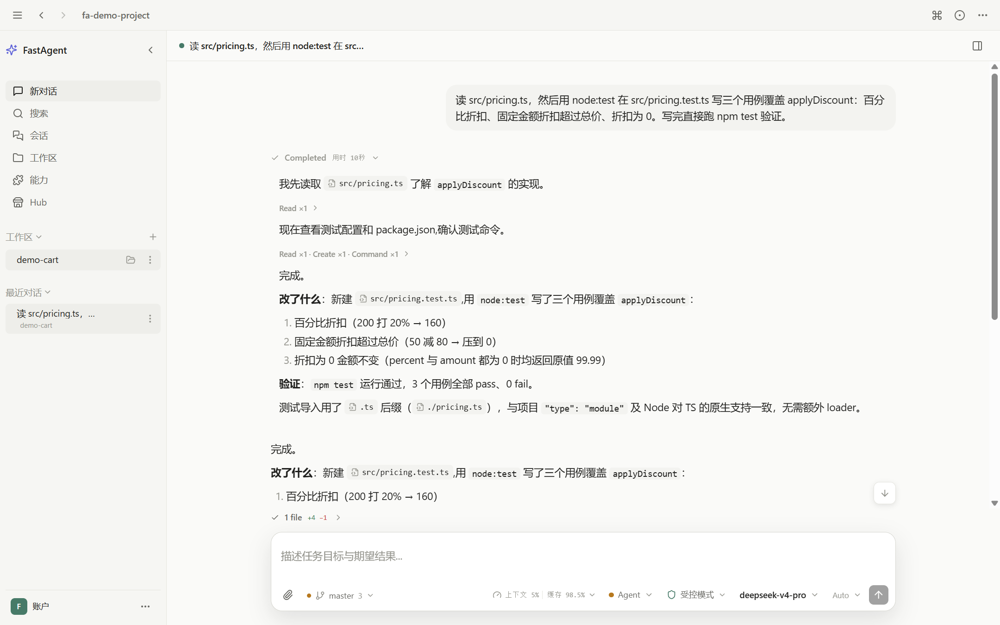
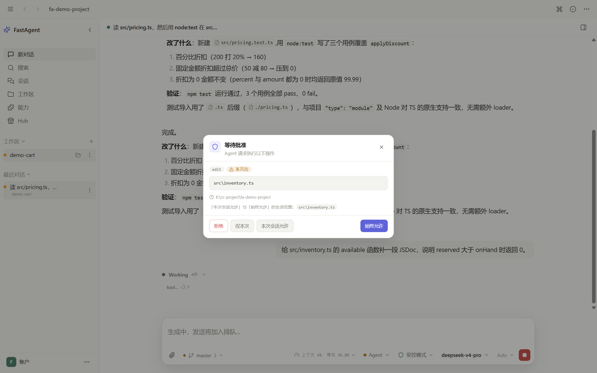
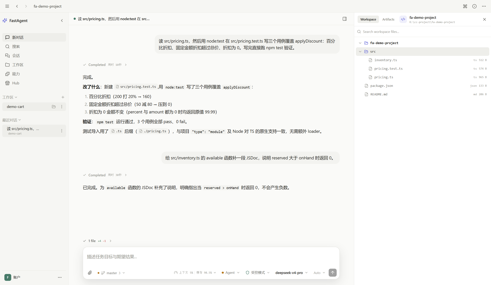
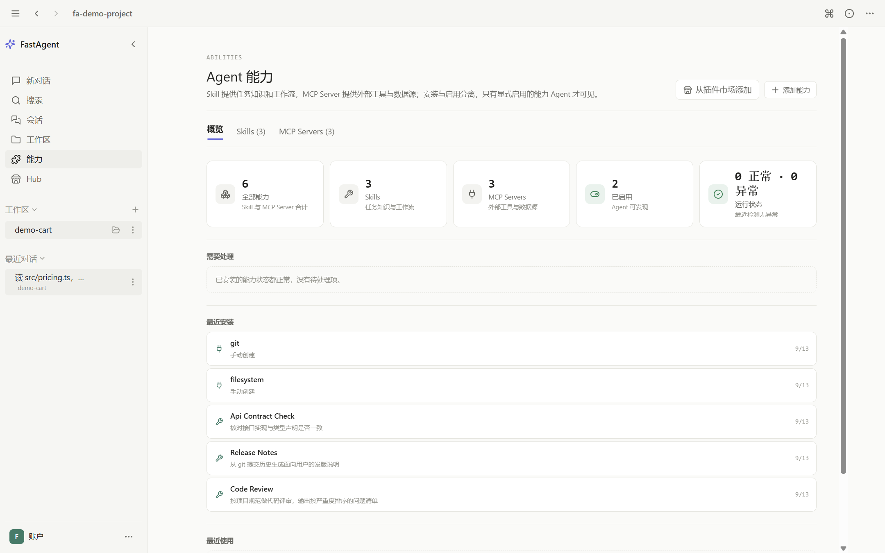
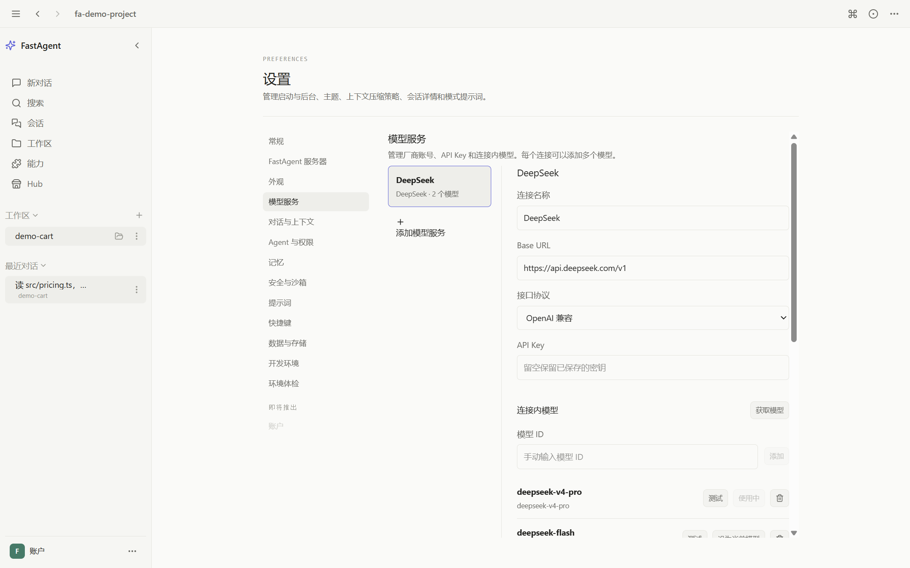
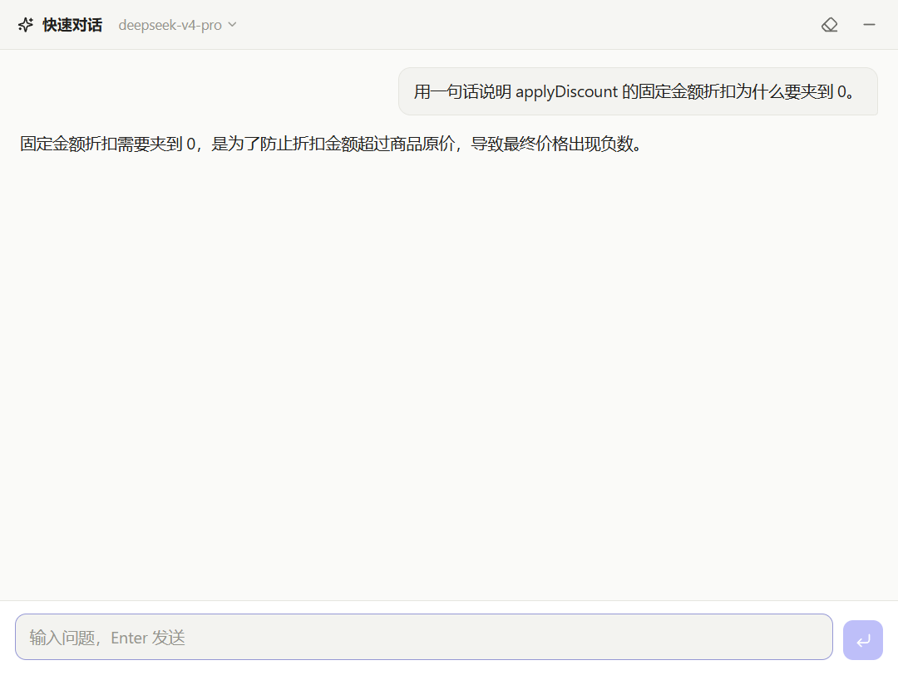

# FastAgent

FastAgent 是一个**本地优先**的 AI Agent工作区桌面应用。你自己带模型 API Key，选一个项目目录，它就能读代码、改文件、跑命令、按计划推进任务——所有会话、设置与凭证都留在本机的 `~/.fa` 目录，不经过任何中转服务。

- 引擎：内嵌 [pi coding-agent](https://github.com/earendil-works/pi) 运行时
- 技术栈：Electron 43 + React 19 + TypeScript + Tailwind 4 + better-sqlite3
- 平台：Windows（沙箱与内置工具链目前只做了 Windows）
- 许可：MIT

## 截图

| 主对话与执行轨迹 | 工具权限审批 |
| --- | --- |
|  |  |

| 资源面板 | 能力中心 |
| --- | --- |
|  |  |

| 模型连接 | 快速对话小窗 |
| --- | --- |
|  |  |

## 核心能力

**自带模型，不绑定后端**
内置 OpenAI、Anthropic、DeepSeek、通义千问、智谱 GLM、Kimi、MiniMax、Google Gemini、OpenRouter 等厂商预设，也支持任意 OpenAI 兼容接口。API Key 走独立加密表存储，不落明文缓存。配好一个连接即可直接进入工作区。

**两种对话模式**
`chat` 只读对话；`agent` 模式放开文件编辑、shell 与待办管理。模式切换即时生效，模型不会拿到当前模式之外的工具。

**计划模式**
写入类工具在权限解析之外被硬拒绝，Agent 只能读代码并输出分步实施计划，确认后再退出计划模式执行。

**权限引擎与审批**
三档预设（询问 / 工作区 / 完全访问）加自定义档位，规则按 last-match-wins 解析，支持「本次允许」「始终允许」。`rm -rf *`、`git push --force` 等全局禁止规则在任何档位都生效；私钥文件（`*.pem`、`id_rsa*` 等）永远拒绝。Agent 连续 3 次重复同一操作会触发死循环守卫并转审批。

**OS 级沙箱**
Rust 实现的沙箱内核：命令跑在受限的系统账户下，只能写当前工作区，工作区外与敏感目录由操作系统拒绝。需要一次管理员初始化。

**内置工具链**
随包分发固定版本的 ripgrep、fd、jq、7-Zip、MinGit 与 Bash——没装 Git for Windows 的机器也能用真正的 bash，而不是降级到 PowerShell。版本与 sha256 写死在 `scripts/fetch-runtime.mjs`，各机器执行环境一致。

**执行轨迹与文件变更账本**
每次工具调用、审批结果、耗时都按轮次归档；写盘工具跑完复查磁盘，给出这一轮每个文件的最终操作与增删行数，而不是听 Agent 自报。

**子 Agent**
只读 Sub-agent 可被主 Agent 委派做调研类任务，角色可自定义，子运行的工具白名单收窄为只读。

**能力中心（Skill / MCP / 插件）**
本地 Skill 管理与校验、MCP 服务器导入与连通性测试、能力打包成 bundle 导出导入、从 Hub 源安装与更新检查。

**上下文管理**
按 provider 真实 usage 计量上下文占用（不是字符数除以 4），支持自动摘要与手动压缩，可配触发比例与保留轮次。

**快速对话小窗**
连按两次 Ctrl 唤起全局小窗；低级键盘钩子只监听不拦截，不影响其他应用的快捷键。鼠标侧键也可绑定。

**其他**
会话管理与分页、全局快捷键自定义、深浅色主题、外部编辑器（Ctrl+G）、`@` 提及文件补全、环境体检（Doctor）、崩溃与启动日志采集、中断任务可续跑。

## 快速开始

需要 Node.js 22+ 与 Windows 10/11。

```bash
git clone https://github.com/Rainron/FastAgent.git
cd FastAgent
npm install
npm run dev
```

首次启动进入登录页，在「模型服务」一侧添加一个模型连接（选厂商 + 填 API Key，或选「自定义 OpenAI 兼容」并填 baseUrl），保存后即可进入工作区。

> 登录页另有「FastAgent 账号」Tab、设置里也有「FastAgent 服务器」分区，那是给自建后端做账号登录与模型下发用的可选通道，需要你自己部署服务端。**开源版不需要它**，配好上面的模型连接就能用全部功能。

### 从源码打包

```bash
npm run package:win
```

会依次执行：Vite 构建 → Rust 沙箱原生程序构建（需要 [Rust 工具链](https://rustup.rs)）→ 下载内置工具链 → electron-builder 产出 NSIS 安装包到 `release/`。

产物未做代码签名，Windows SmartScreen 会提示「未知发布者」，这是未签名安装包的正常表现。

### 开发命令

| 命令 | 作用 |
| --- | --- |
| `npm run dev` | 启动应用并热重载 |
| `npm run build` | Vite 编译，产物到 `out/` |
| `npm run typecheck` | TypeScript 检查（项目唯一静态门槛） |
| `npm test` | Vitest 单次运行（必须在仓库根目录执行） |
| `npm run build:native` | 构建 Rust 沙箱原生程序 |
| `npm run fetch:runtime` | 下载并校验内置工具链 |

## 数据目录

所有数据落在 `~/.fa`：

```
~/.fa
├── fastagent.db      会话、设置、权限规则、能力元数据（SQLite）
├── sessions/         按 用户/创建日期/会话 id 分层的 pi 会话文件
├── skills/  mcp/  plugins/   本地能力
├── attachments/  exports/  backups/
├── cache/  temp/  logs/
```

设置页「数据与存储」可以查看、打开各目录，也可以整体迁移数据根。

## 安全边界

- **权限引擎 fail-closed**：规则命中不到就走审批，不默认放行。
- **安全守卫**：密钥文件分类（`.env`、`.aws/credentials`、私钥等）独立于权限档位判定；私钥类一律拒绝。
- **工作区边界**：工作区外路径映射到独立的 `external_directory` 权限入口。
- **沙箱**：命令执行受操作系统账户权限约束，不依赖 Agent 自觉。
- **死循环守卫**：重复调用达阈值即转审批。
- 日志与诊断导出前做密钥脱敏。

## 架构

主进程按「生命周期 → IPC → 领域模块」分层，渲染层按「容器组件 → hooks → 纯逻辑模块」分层，纯逻辑模块配单元测试（当前 150 个测试文件、1433 个用例）。

- `src/main/` 主进程：agent 引擎（工具运行时、权限引擎、安全守卫、沙箱）、`local-store` 数据层、能力注册表
- `src/preload/` 上下文桥接，向渲染进程暴露类型化 API
- `src/renderer/` React UI，按功能分目录（workspace、composer、conversation、settings、features）
- `src/shared/` 进程间共享类型与规则

## 接下来做什么

下一个版本主要想解决「任务跑到一半关掉界面就断了」这件事——让运行状态可对账、重载后能接回正在跑的任务；同时把能力管理和插件市场收成一处，界面动效也会补齐。

再往后的方向大致是：让 Agent 能操作本机窗口完成 GUI 任务；对话内查找与模型连通性自测这类日常体验；会话导出与用量统计；跨会话的长期记忆和项目知识库；以及 Git 面板、插件体系这些围绕工作区的能力。

不承诺时间点，做完一块发一块。想优先看到哪个，欢迎提 issue。

## 第三方组件

| 组件 | 用途 | 许可 |
| --- | --- | --- |
| [@earendil-works/pi-coding-agent](https://github.com/earendil-works/pi) | agent 运行时 | MIT |
| [Electron](https://electronjs.org) / React / Tailwind | 应用框架 | MIT |
| [better-sqlite3](https://github.com/WiseLibs/better-sqlite3) | 本地数据库 | MIT |
| [uiohook-napi](https://github.com/SnosMe/uiohook-napi) | 全局键鼠钩子 | MIT |
| ripgrep / fd / jq / 7-Zip / MinGit / Bash | 内置工具链，构建时按固定版本下载 | 各自原许可，随包落到 `resources/runtime/*/licenses/` |

## License

[MIT](LICENSE) © 2026 lake
